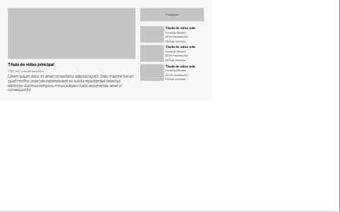
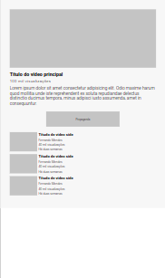
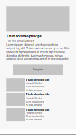

# Exercício layout Toutube com grid

#### Exercício layout Toutube com grid faz parte dos exercícios de CSS avançado do curso de formação Fullstack da DEV QUEST - Dev em Dobro. O exercício tem o objetivo de consolidar conceitos avançados de CSS. Obrigado por conferir o meu cógigo.

## Índice

- [Captura de tela](#captura-de-tela)
- [Links](#links)
- [Construído com](#construído-com)
- [O que aprendi](#o-que-aprendi)
- [Desenvolvimento contínuo](#desenvolvimento-contínuo)
- [Recursos úteis](#recursos-úteis)
- [Fernando Mendes](#autor)

### Captura de tela

#### Tela Desktop



#### Tela Ipad



#### Tela Mobile



### Links

- Site URL: https://nandosti.github.io/layout-youtube-com-grid/

### Construído com

<div style="display: inline_block"><br>
  
         
</div>

## O que aprendi

Aprendi a criar de layouts complexos e responsivos usando as propriedades do CSS Grid Layout e do Flexbox. Adaptei o layout para diferentes tamanhos de tela usando media queries. Apliquei uma regra de mídia para dispositivos menores, alterando o layout e garantindo uma experiência agradável em dispositivos móveis.


## Trechos de códigos

```
.container{
    background-color: #f7f7f7;
    display: grid;
    grid-template-areas: 
    "principal   propaganda"
    "principal   side";
    grid-template-columns: 1fr 270px;
    grid-template-rows: 56px 1fr;
    max-width: 900px;
    padding: 35px;
    gap: 20px;
}

.container .principal{
    grid-area: principal;
}

.container .propaganda{
    grid-area: propaganda;
}

.container .side{
    grid-area: side;
}

.container .propaganda{
    position: relative;
    display: flex;
    justify-content: center;
    align-items: center;
}

```

## Desenvolvimento contínuo

Pretendo continuar focado em construir um conhecimento sólido nessas tecnologias. Ainda há muitos conceitos importantes para serem desenvolvidos. Todos os dias aprendo novos conceitos que são gradativamente adicionados ao meu repertório de ferramentas.

## Recursos úteis

- [Mdn](https://developer.mozilla.org/en-US/) - O Mozilla Developer Network (MDN) desempenha um papel crucial ao fornecer recursos abrangentes e atualizados para desenvolvedores web em todo o mundo.
- [W3School](https://www.w3schools.com/css/default.asp) - O W3Schools é um recurso online amplamente utilizado por desenvolvedores para aprender e aprimorar suas habilidades em tecnologias web.
- [Dev em Dobro](https://www.youtube.com/@DevemDobro) - Este é um canal onde encontro muito material. Tem muito conteúdo relacionado ao desenvolvimento. Recomendo a todos que querem aprender sobre esse e outros conceitos relacionados.

## Autor

[Fernando Mendes](https://www.linkedin.com/in/fernandomendesti/)
